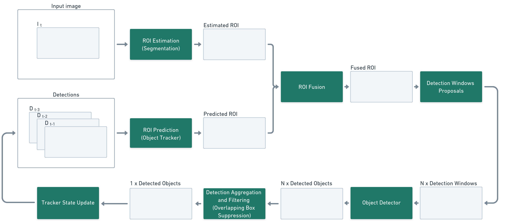

# SegTrackDetect

SegTrackDetect is a modular framework designed for accurate small object detection using a combination of segmentation and tracking techniques. It performs detection within selected Regions of Interest (ROIs), providing a highly efficient solution for scenarios where detecting tiny objects with precision is critical. The framework's modularity empowers users to easily customize key components, including the ROI Estimation Module, ROI Prediction Module, and Object Detector. It also features our Overlapping Box Suppression Algorithm that efficiently combines detected objects from multiple sub-windows, filtering them to overcome the limitations of window-based detection methods. 


See the following sections for more details on the framework, its components, and customization options:
- [SegTrackDetect Architecural Design](#architecture)
- [ROI Fusion Module](#roi-fusion-module)
- [Object Detection Module](#object-detection)
- [Detection Aggregation and Filtering](#detection-aggregation-and-filtering).

To get started with the framework right away, head to the [Getting Started](#getting-started) section.


# Getting Started

## Depencencies
To simplify the setup process, we provide a Dockerfile that manages all necessary dependencies for you. Follow these steps to get started:
1. **Install Docker:** Begin by installing the [Docker Engine](https://docs.docker.com/engine/install/)
2. **Install NVIDIA Container Toolkit:** If you plan to run detection on a GPU, make sure to install the [NVIDIA Container Toolkit](https://docs.docker.com/engine/install/)

Once you have Docker set up, you can download all the trained models listed in the [Model ZOO](#model-zoo) and build the Docker image by running the following command:
```bash
./build_and_run.sh
```

We currently support four [datasets](#datasets), and we provide scripts to download and convert them into a compatible format. To download and convert all datasets at once, execute:
```bash
./scripts/download_and_convert.sh
```
If you prefer to download specific datasets, you can run the corresponding scripts located in the [`scripts`](scripts/) directory. 

⚠️  For the MTSD dataset, please visit the [official dataset page](https://www.mapillary.com/dataset/trafficsign) to download the data manually. For details on the required directory structure, refer to [this script](https://github.com/deepdrivepl/SegTrackDetect/blob/main/scripts/download_MTSD.sh). After downloading the dataset and the [older annotation version](https://github.com/deepdrivepl/SegTrackDetect/releases/download/v0.1/annotations_v1.zip), you will need to convert it to the framework format using:
```bash
python /SegTrackDetect/scripts/converters/MTSD.py
```


## Examples
The SegTrackDetect framework enables robust tiny object detection both across consecutive video frames (video mode) and within independent detection windows. The dataset type is automatically inferred from the dataset directory structure. For more information, see [datasets](#new-datasets).

To perform detection on video data using a supported dataset like `SeaDronesSee`, run the following command:
```bash
python inference.py \
--roi_model 'SDS_large' --det_model 'SDS' --tracker 'sort' \
--data_root '/SegTrackDetect/data/SeaDronesSee' --split 'val' \
--bbox_type 'sorted' --allow_resize --obs_iou_th 0.1 \
--out_dir 'results/SDS/val' --debug
```

To detect objects in independent windows, for instance, using the `MTSD` dataset, you can use the same script with slight modifications:
```bash
python inference.py \
--roi_model 'MTSD' --det_model 'MTSD' \
--data_root '/SegTrackDetect/data/MTSD' --split 'val'  \
--bbox_type 'sorted' --allow_resize --obs_iou_th 0.7 \
--out_dir 'results/MTSD/val' --debug
```

The following table outlines the command-line arguments that can be used when running the inference script. These arguments allow you to customize the behavior of the detection process by specifying models, datasets, and various configurations.

| Argument          | Type      | Description                                                                                                                                 |
|:-------------------:|-----------|---------------------------------------------------------------------------------------------------------------------------------------------|
| `--roi_model`     | `str`     | Specifies the ROI model to use (e.g., `SDS_large`). All available ROI models are defined [here](rois/estimator/configs/__init__.py)         |
| `--det_model`     | `str`     | Specifies the detection model to use (e.g., `SDS`). All available detectors are defined [here](detector/configs/__init__.py)                |
| `--tracker`       | `str`     | Specifies the tracker to use (e.g., `sort`). All available trackers are defined [here](rois/predictor/configs/__init__.py)                  |
| `--data_root`     | `str`     | Path to the dataset directory (e.g., `/SegTrackDetect/data/MTSD`                                                                            |
| `--split`         | `str`     | Data split to use (e.g., `val` for validation). If present, the script will save the detections using the coco image ids used in `val.json` |
| `--flist`         | `str`     | An alternative version of providing an image list, path to the file with absolute paths to images.                                          |
| `--name`          | `str`     | A name for provided `flist`, coco annotations `name.json` will be generated and saved in the dataset root directory                         |
| `--bbox_type`     | `str`     | Type of the detection window filtering algorithm (`all` - no filtering, `naive`, `sorted`).                                                 |
| `--allow_resize`  | `flag`    | Enables resizing of cropped detection windows. Siling window within large ROIs will be used otherwise.                                      |
| `--obs_iou_th`    | `float`   | Sets the IoU threshold for Overlapping Box Suppresion (default is 0.7).                                                                     |
| `--cpu`           | `flag`    | Use `cpu` for computations, if not set use `cuda`                                                                                           |
| `--out_dir`       | `str`     | Directory to save output results (e.g., `results/SDS/val`).                                                                                 |
| `--debug`         | `flag`    | Enables saving visualisation in `out_dir`                                                                                                   |
| `--vis_conf_th`   | `float`   | Confidence threshold for the detections in visualisation, default 0.3.                                                                      |


All available models can be found in [Model ZOO](#model-zoo). Currently, we provide trained models for 4 detection tasks. 

## Customization
### Existing Models
You can easily customize the behavior of existing models in the SegTrackDetect framework. This includes modifying post-processing functions or adjusting parameters such as thresholds and dilations. To do this, locate the configuration dictionaries for the models you wish to customize in the respective configuration directories. For instance, you can find the configurations for ROI estimation models in the [estimator configs](rois/estimator/configs/) directory, for ROI prediction models in the [predictor configs](rois/predictor/configs/), and for object detectors in the [detectors config](https://github.com/deepdrivepl/SegTrackDetect/blob/main/detector/configs/yolo.py) directory.


### New Models
To add new models to the framework, you will need to create a configuration dictionary for your model. Place this configuration in the appropriate directory (e.g., [estimator configs](rois/estimator/configs/) for ROI estimation models, [predictor configs](rois/predictor/configs/) for ROI predictors or [detectors configs](detector/configs) for object detectors). After defining your model and its configuration, register the new model in the relevant ESTIMATOR_MODELS, PREDICTOR_MODELS or DETECTION_MODELS in the __init__.py file to enable its use in main scripts.

By following these steps, you can seamlessly integrate custom models into the SegTrackDetect framework, enhancing its capabilities to meet your specific needs.

For more details on integrating new trackers into ROI Prediction module see [this](#roi-prediction-with-object-trackers) section.


### New Datasets
You can use any dataset that adheres to the specified directory structure for video data. The required structure for organizing videos in the SegTrackDetect framework is as follows:
```bash
SegTrackDetect/data/YourVideoDataset/
├── images
│   ├── seq1               # Sequence 1 with A images
│   ├── seq2               # Sequence 2 with B images
│   ├── seq3               # Sequence 3 with C images
│   ├── seq4               # Sequence 4 with D images
│   └── ...                # Additional sequences as needed
├── split_x.json           # Annotations in COCO format
├── split_y.json           # Annotations in COCO format
└── split_z.json           # Annotations in COCO format
```
Each sequence (e.g., `seq1`, `seq2`, etc.) should contain its respective images. 


You can use any dataset that follows the specified directory structure for image data. The required structure for organizing images in the SegTrackDetect framework is as follows:
```bash
SegTrackDetect/data/YourImageDataset/
├── images                # All images should be placed directly in this directory
│   ├── image1.jpg       # Image file 1
│   ├── image2.jpg       # Image file 2
│   ├── image3.png       # Image file 3
│   └── ...              # Additional image files as needed
├── split_x.json         # Annotations in COCO format
├── split_y.json         # Annotations in COCO format
└── split_z.json         # Annotations in COCO format
```
All image files (e.g., `image1.jpg`, `image2.jpg`, etc.) should be placed directly in the `images` directory. 

The annotations.json files should contain the annotations for the respective splits. Please ensure that the file_name entries in the annotations point to absolute paths for proper integration.
Once your dataset is structured correctly, you can integrate it into the framework, allowing you to run inference and perform other operations on your video data. 


## Metrics
To assess the performance of the SegTrackDetect framework, we use a customized COCO metrics implementation designed for tiny objects, available in the [tinycocoapi](https://github.com/Cufix/tinycocoapi) repository. 

A dedicated script is provided to compute evaluation metrics, comparing predicted detections with ground truth annotations. The inference script ensures proper indexing of images.

To run the metrics computation script, use the following command:
```bash
python metrics.py --dir <directory_with_detections> --gt_path <path_to_ground_truth_json> --th <score_threshold> --csv <path_to_save_metrics>
```
This will generate the evaluation metrics and save them in the specified CSV file for further analysis.


# Architecture

SemSegTrack is an object detection framework that selects ROIs for detailed detection through two main modules: the **ROI Prediction Module** and the **ROI Estimation Module**.
- The **ROI Prediction Module** leverages object tracking to predict object locations based on previous detections and is specifically used in video mode. Users can switch between video or image mode, depending on their use case
- The **ROI Estimation Module** uses binary semantic segmentation to identify promising regions within the input image
  
Both branches feed into the **ROI Fusion Module**, where their outputs are merged. The framework then determines a set of detection window coordinates. Detection is performed independently on each window, and the results are aggregated. To prevent redundancy, the **Overlapping Box Suppression Algorithm** filters overlapping detections. In video mode, detections are further utilized to update the tracker’s state.



## ROI Fusion Module
The ROI Fusion Module merges output masks from both branches and utilizes the fused mask to determine detection window coordinates. Based on the dataset being used, the framework offers flexibility with two strategies for handling large ROIs: resizing or sliding window detection. If the `--allow_resize` flag is enabled, large ROIs (exceeding the detection window size) will be cropped and scaled to fit the detector’s input. Otherwise, a sliding-window approach will be applied within the larger ROI regions. Detection windows are generated by positioning them at the center of each ROI region. Prior to detection, they undergo a filtering process to eliminate unnecessary detector calls for redundant windows. Both the Prediction and Estimation branches are designed to be highly customizable, allowing users to fine-tune the framework for a wide range of scenarios. While the included datasets are examples, all decisions should be driven by the specific data at hand, ensuring the best performance in real-world applications.

### ROI Prediction with Object Trackers
The framework currently integrates the SORT tracker from a forked repository, allowing for efficient ROI prediction in video mode. However, the framework is designed to be adaptable, enabling users to integrate any other object tracker, provided that the tracker's prediction and update functions are modular and separate. For guidance, users can refer to [our implementation of the SORT tracker](https://github.com/deepdrivepl/SORT/blob/master/sort.py) to see how it has been adapted to fit seamlessly within the framework's workflow. Below is a template you can use to adapt any tracker to use in ROI Prediction:

```python
class CustomTracker:
    """
    Template for a custom object tracker class designed to handle both prediction and update steps separately.
    """

    def __init__(self, *args, **kwargs):
        """
        Initialize CustomTracker with arguments required by your tracker.
        """

    def get_pred_locations(self):
        """
        Predicts locations of the trackers in the current frame.
        This function should retrieve and predict the positions of existing trackers.
        
        Returns:
            np.ndarray: A numpy array of predicted bounding boxes in the format [[x1, y1, x2, y2, score], ...].
        """

    def update(self, dets=np.empty((0, 5)), trks=[]):
        """
        Updates the tracker's internal state with new detections and predicted tracker locations.

        Args:
            dets (np.ndarray): A numpy array of detections in the format [[x1, y1, x2, y2, score], ...].
            trks (np.ndarray): Predicted tracker locations from `get_pred_locations()`.

        Returns:
            np.ndarray: Updated tracker states in the format [[x1, y1, x2, y2, track_id, score], ...].
        """
```

### Integrating Your Custom Tracker
Once you've implemented your `CustomTracker` class, follow these steps to integrate it into the framework:
1. Save the tracker class in the [predictor](rois/predictor) module as a new file (e.g., `CustomTracker.py`).
2. Define your tracker’s configuration in the  [config directory](rois/predictor/configs) by creating a new Python file (e.g., `custom.py`).
   
    Example `custom.py`:
    ```python
    custom = dict(
      module_name = 'rois.predictor.CustomTracker', 
      class_name = 'CustomTracker',
      args = dict(
          ...
      ),
      frame_delay = 3,
    )
    ```
3. Register the Custom Tracker in `PREDICTOR_MODELS` in [`__init__.py`](https://github.com/deepdrivepl/SegTrackDetect/blob/main/rois/predictor/configs/__init__.py#L35)
   
   Example:
   ```python
   PREDICTOR_MODELS = {
      "sort": sort,
      "custom": custom,
   }
   ```

### ROI Estimation with Segmentation
The ROI Estimation Module processes input images to generate probability masks used for selecting Regions of Interest (ROIs). All models utilized in this module are in TorchScript format, ensuring seamless integration into the framework.

A comprehensive list of currently supported models, along with their names, can be found in the [model ZOO](#region-of-interest-estimation). The behavior of the ROI Estimation Module can be easily customized for the existing models, and you can also add your own models. To do this, navigate to the [estimator configs](rois/estimator/configs/) directory and create your own configuration dictionaries. Remember to register any new configurations in the [`ESTIMATOR MODELS`](https://github.com/deepdrivepl/SegTrackDetect/blob/main/rois/estimator/configs/__init__.py) to enable their usage by name in the main scripts.

For existing models, you can implement new postprocessing functions or modify postprocessing parameters (e.g., thresholding or dilation). Please ensure that the  `postprocess` function returns the mask in a  `[H, W]` format.

## Object Detection
In SegTrackDetect, the object detector is executed multiple times for each sub-window to effectively capture the features of tiny objects. A comprehensive list of all available models can be found in the [model ZOO](#object-detectors). You can customize the behavior of each model (e.g., the NMS parameters) by modifying the configuration dictionaries located in the [detectors config](https://github.com/deepdrivepl/SegTrackDetect/blob/main/detector/configs/yolo.py) directory.

New models can be registered similarly to the ROI Estimation Models: create a new configuration dictionary and register it in the [`DETECTION_MODELS`](https://github.com/deepdrivepl/SegTrackDetect/blob/main/detector/configs/__init__.py).

## Detection Aggregation and Filtering
Finally, detections from all sub-windows are aggregated and filtered using the Overlapping Box Suppression (OBS) Algorithm. OBS leverages the sub-window coordinates to eliminate partial detections that arise from overlapping detection sub-windows. You can customize the IoU threshold for OBS using the `--obs_iou_th argument` in the main scripts. For more detailed information on OBS, please refer to the [documentation](detector/obs.py).


# Model ZOO

In the SegTrackDetect framework, we utilize a range of pre-trained models for both Region of Interest (ROI) Estimation and Object Detection. All models are provided in TorchScript format, enabling seamless integration and deployment within the system. Below, you will find a comprehensive list of supported models along with their respective details, including the objects they target, the datasets used for training, input sizes, links to the pre-trained weights, and their configurations.

## Region of Interest Estimation

|  Model | Objects of Interest |    Dataset   | Model name | Input size | Weights                                                                                    | Config |
|:------:|:-------------------:|:------------:|:----------:|:----------:|:------------------------------------------------------------------------------------------:|:------:|
| u2netp |    traffic signs    |     MTSD     |  MTSD      |   576x576  | [here](https://github.com/deepdrivepl/SegTrackDetect/releases/download/v0.1/u2netp_MTSD.pt)       |[here](https://github.com/deepdrivepl/SegTrackDetect/blob/main/rois/estimator/configs/u2net.py#L69)|
|  unet  |         fish        |   ZebraFish  |  ZeF20     | 160x256    | [here](https://github.com/deepdrivepl/SegTrackDetect/releases/download/v0.1/unetR18-ZebraFish.pt) |[here](https://github.com/deepdrivepl/SegTrackDetect/blob/main/rois/estimator/configs/unet.py#L66)|
|  unet  |        people       |  DroneCrowd  |  DC_tiny   |  96x160    | [here](https://github.com/deepdrivepl/SegTrackDetect/releases/download/v0.1/DroneCrowd-001-R18-96x160-best-loss.pt) |[here](https://github.com/deepdrivepl/SegTrackDetect/blob/main/rois/estimator/configs/unet.py#L80)|
|  unet  |        people       |  DroneCrowd  |  DC_small  |  192x320   | [here](https://github.com/deepdrivepl/SegTrackDetect/releases/download/v0.1/DroneCrowd-001-R18-192x320-best-loss.pt) |[here](https://github.com/deepdrivepl/SegTrackDetect/blob/main/rois/estimator/configs/unet.py#L93)|
|  unet  |        people       |  DroneCrowd  |  DC_medium |  384x640   | [here](https://github.com/deepdrivepl/SegTrackDetect/releases/download/v0.1/DroneCrowd-001-R18-384x640-best-loss.pt) |[here](https://github.com/deepdrivepl/SegTrackDetect/blob/main/rois/estimator/configs/unet.py#L106)|
|  unet  |    people, boats    | SeaDronesSee |  SDS_tiny  |   64x96    | [here](https://github.com/deepdrivepl/SegTrackDetect/releases/download/v0.1/SeaDronesSee-000-R18-64x96-best-loss.pt) |[here](https://github.com/deepdrivepl/SegTrackDetect/blob/main/rois/estimator/configs/unet.py#L120)|
|  unet  |    people, boats    | SeaDronesSee | SDS_small  |   128x192  | [here](https://github.com/deepdrivepl/SegTrackDetect/releases/download/v0.1/SeaDronesSee-000-R18-128x192-best-loss.pt) |[here](https://github.com/deepdrivepl/SegTrackDetect/blob/main/rois/estimator/configs/unet.py#L133)|
|  unet  |    people, boats    | SeaDronesSee | SDS_medium |   224x384  | [here](https://github.com/deepdrivepl/SegTrackDetect/releases/download/v0.1/SeaDronesSee-000-R18-224x384-best-loss.pt) |[here](https://github.com/deepdrivepl/SegTrackDetect/blob/main/rois/estimator/configs/unet.py#L146)|
|  unet  |    people, boats    | SeaDronesSee | SDS_large  |   448x768  | [here](https://github.com/deepdrivepl/SegTrackDetect/releases/download/v0.1/SeaDronesSee-000-R18-448x768-best-loss.pt) |[here](https://github.com/deepdrivepl/SegTrackDetect/blob/main/rois/estimator/configs/unet.py#L159)|

## Object Detectors

|  Model        | Objects of Interest |    Dataset   | Model name | Input size | Weights                                                                                    | Config |
|:------------: |:-------------------:|:------------:|:----------:|:----------:|:------------------------------------------------------------------------------------------:|:------:|
| yolov4        |    traffic signs    |     MTSD     | MTSD       |   960x960  | [here](https://github.com/deepdrivepl/SegTrackDetect/releases/download/v0.1/yolov4_MTSD.pt)      |[here](https://github.com/deepdrivepl/SegTrackDetect/blob/main/detector/configs/yolo.py#L107)|
| yolov7 tiny   |         fish        |   ZebraFish  |  ZeF20     |   160x256  | [here](https://github.com/deepdrivepl/SegTrackDetect/releases/download/v0.1/yolov7t-ZebraFish.pt) |[here](https://github.com/deepdrivepl/SegTrackDetect/blob/main/detector/configs/yolo.py#L65)|
| yolov7 tiny   |        people       |  DroneCrowd  |  DC       |   512x512  | [here](https://github.com/deepdrivepl/SegTrackDetect/releases/download/v0.1/004-DroneCrowd-yolov7-tiny-512x512-crops-only-multiple-scales-50ep-best.torchscript.pt) |[here](https://github.com/deepdrivepl/SegTrackDetect/blob/main/detector/configs/yolo.py#L94)|
| yolov7 tiny   |    people, boats    | SeaDronesSee |  SDS        |   512x512  | [here](https://github.com/deepdrivepl/SegTrackDetect/releases/download/v0.1/006-SeaDronesSee-yolov7-tiny-512x512-crops-only-multiple-scales-300ep-best.torchscript.pt) |[here](https://github.com/deepdrivepl/SegTrackDetect/blob/main/detector/configs/yolo.py#L79)|


# Datasets
The SegTrackDetect framework supports a variety of datasets tailored for different object detection tasks. Each dataset is accompanied by specific models designed to optimize performance in their respective domains. Below is a list of the supported datasets, along with suitable ROI and detection models that can be utilized for inference. These datasets encompass a range of scenarios, from traffic sign recognition to maritime object detection, enabling comprehensive evaluation and testing of the framework's capabilities.

Supported Datasets:
- Mapillary Traffic Sign Dataset 🚥
- ZebraFish 🐟
- DroneCrowd 🚁
- SeaDronesSee 🌊

# Licence

The code in this repository is licensed under the [MIT License](LICENSE).<br /> 
For third-party submodules, such as the [SORT tracker](https://github.com/deepdrivepl/SORT), please refer to their respective licenses.<br /> 
All trained models are distributed under licenses that comply with the terms of the datasets they were trained on.


# Acknowledgements

This project makes use of the following datasets, model architectures, and object tracking methods:

Datasets:
- :stop_sign: [Mapillary Traffic Sign Dataset](https://www.mapillary.com/dataset/trafficsign) for traffic sign detection examples
- :fish: [ZebraFish 3D](https://motchallenge.net/data/3D-ZeF20/) for fish detection examples
- :boat: [SeaDronesSee](https://seadronessee.cs.uni-tuebingen.de/) for maritime object detection from drones
- :busts_in_silhouette: [DroneCrowd](https://github.com/VisDrone/DroneCrowd) for crowd detection in drone videos

Models:
- :red_square: [UNet](https://arxiv.org/abs/1505.04597) and :purple_square: [U<sup>2</sup>Net](https://arxiv.org/abs/2005.09007) in ROI Estimation Module
- :yellow_square: [SORT](https://arxiv.org/abs/1602.00763) tracker in ROI Prediction Module
- :blue_square: [YOLOv4](https://arxiv.org/abs/2004.10934) and :brown_square: [YOLOv7](https://arxiv.org/abs/2207.02696) in Object Detection Module

---
This research was supported by the Ministry of Education and Science under the "Doktorat Wdrożeniowy" program.
